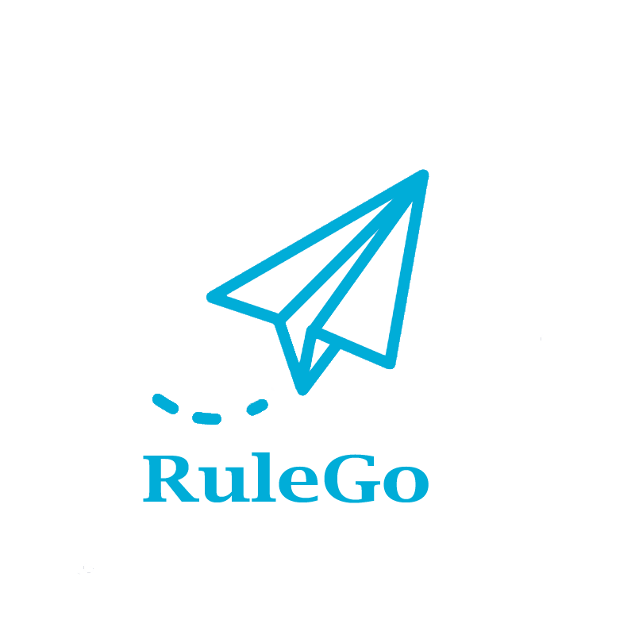
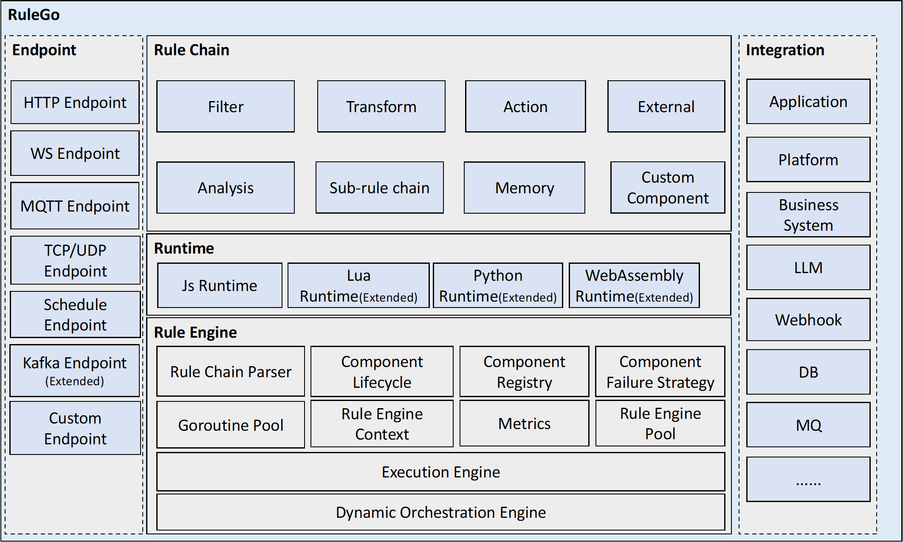
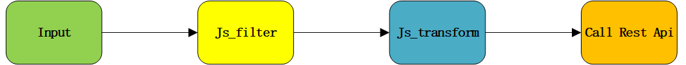
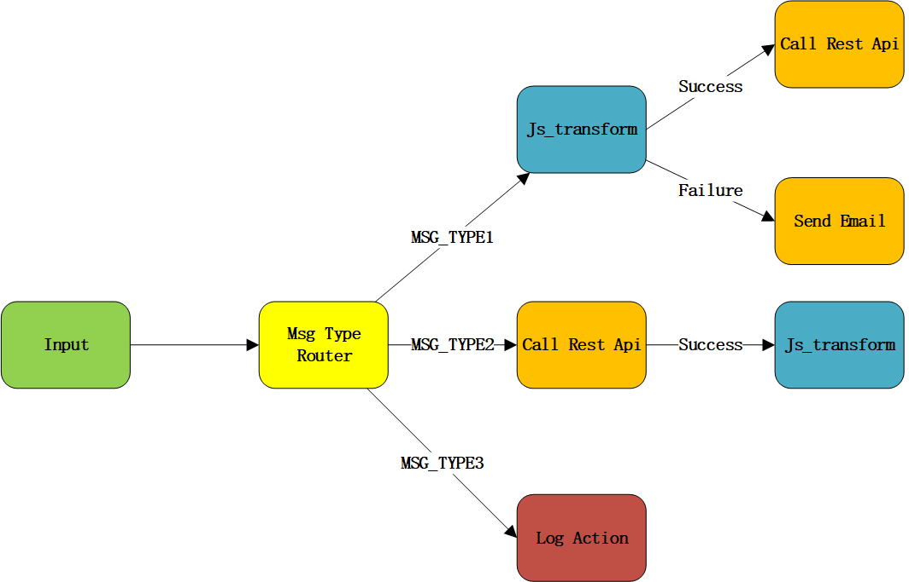
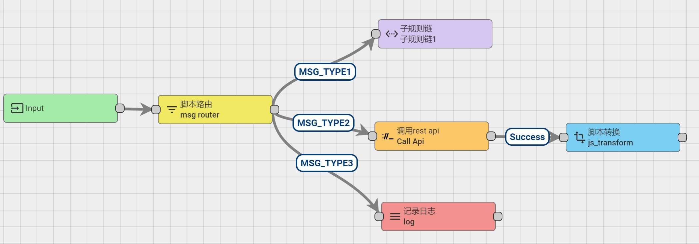
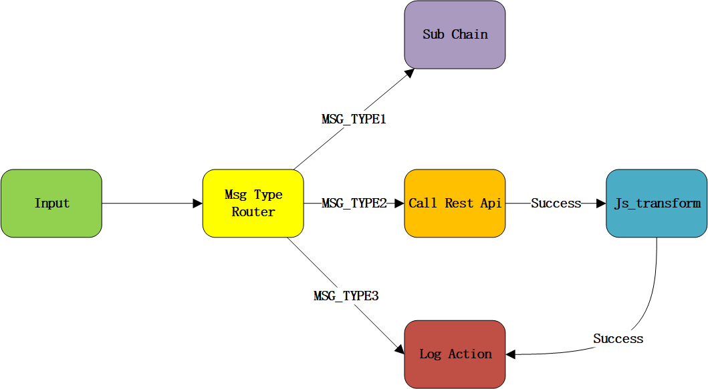

# RuleGo

English| [中文](README_ZH.md)

   

`RuleGo` is a lightweight, high-performance, embedded, orchestrable component-based rule engine based on `Go` language. 
It is also a flexible and highly customizable event processing framework. Support heterogeneous system data integration. It can aggregate, distribute, filter, transform, enrich and execute various actions on input messages.

## Documentation

RuleGo documentation is hosted on: [rulego.cc](https://rulego.cc) .

## Features

* **Lightweight:** No external middleware dependencies, can efficiently process and link data on low-cost devices, suitable for IoT edge computing.
* **High performance:** Thanks to the high-performance characteristics of `Go`, in addition, `RuleGo` adopts technologies such as coroutine pool and object pool. For 10W data processing `JS script filtering->JS script data processing->HTTP push`, the average time is 9 seconds.
* **Embedded:** Support embedding `RuleGo` into existing projects, non-intrusively utilizing its features.
* **Componentized:** All business logic is componentized and can be flexibly configured and reused.
* **Rule chain:** You can flexibly combine and reuse different components to achieve highly customizable and scalable business processes.
* **Process orchestration:** Support dynamic orchestration of rule chain components, replace or add business logic without restarting the application.
* **Easy to extend:** Provide rich and flexible extension interfaces, you can easily implement custom components or introduce third-party components.
* **Dynamic loading:** Support dynamic loading of components and extension components through `Go plugin`.
* **Rule chain nesting:** Support sub-rule chain nesting, realize process reuse.
* **Built-in common components:** `Message type Switch`,`JavaScript Switch`,`JavaScript filter`,`JavaScript converter`,`HTTP push`,`MQTT push`,`Send email`,`Log record` and other components. You can extend other components by yourself.
* **Context isolation mechanism:** Reliable context isolation mechanism, no need to worry about data streaming in high concurrency situations.

## Use Cases

`RuleGo` is a rule engine based on orchestration, which is best at decoupling your system.

- If your system is complex and bloated with code
- If your business scenario is highly customized or frequently changed
- If your system needs to interface with a large number of third-party systems or protocols
- Or you need an end-to-end IoT solution
- Or you need to process data from heterogeneous systems centrally
- Or you want to try hot deployment in `Go` language...
  Then `RuleGo` framework will be a very good solution.

#### Typical use cases

* **Edge computing:** For example: You can deploy `RuleGo` on the edge server, preprocess, filter, aggregate or calculate the data before reporting it to the cloud. The data processing rules and distribution rules can be dynamically configured and modified through the rule chain without restarting the system.
* **Internet of Things:** For example: Collect device data reporting, and after the rule judgment of the rule chain, trigger one or more actions, such as: send email, send alarm, and link with other devices or systems.
* **Data distribution:** For example: You can distribute data to different systems according to different message types, such as HTTP, MQTT or gRPC.
* **Application integration:** Use `RuleGo` as a glue to various different systems or protocols, such as: ssh,webhook,kafka, message queue, database, chatGPT, third-party systems.
* **Data processing from heterogeneous systems:** For example: Receive data from different data sources (such as MQTT, HTTP,WS,TCP/UDP etc.), and then filter, format conversion, and then distribute to databases, business systems or dashboards.
* **Highly customized business:** For example: Decouple highly customized or frequently changed business and hand it over to `RuleGo` rule chain for management. Business requirements change without restarting the main program.
* **Complex business orchestration:** For example: Encapsulate the business into custom components, and use `RuleGo` to orchestrate and drive these custom components, and support dynamic adjustment.
* **Microservice orchestration:** For example: Use `RuleGo` to orchestrate and drive microservices, or dynamically call third-party services to process business and return results.
* **Business code and business logic decoupling:** For example: User points calculation system, risk control system.
* **Flexible configuration and highly customized event processing framework:** For example: Asynchronously or synchronously process different message types.
* **Automation:** For example, process automation systems, marketing automation systems.

## Architecture Diagram

  
<p align="center"> RuleGo Architecture Diagram</p>

## Installation

Use the `go get` command to install `RuleGo`:

```bash
go get github.com/rulego/rulego
```

## Usage

First, define the rule chain in Json format. The rule chain definition does not require learning a specific rule syntax or DSL, just configure the components and connect them with certain relationships, and you can achieve your functional requirements. Rule chain definition: [Reference rule chain](https://rulego.cc/pages/6f46fc/)

RuleGo is extremely simple and lightweight. Just follow these 2 steps:

1. Import the `RuleGo` package and use the rule chain definition to create a rule engine instance:

```go
import "github.com/rulego/rulego"

//Use the rule chain definition to create a rule engine instance
ruleEngine, err := rulego.New("rule01", []byte(ruleFile))
```

2. Pass the message payload, message type, and message metadata to the rule engine instance, and the rule engine will process the message according to the rule chain definition:

```go
//Define message metadata
metaData := types.NewMetadata()
metaData.PutValue("productType", "test01")
//Define message payload and message type
msg := types.NewMsg(0, "TELEMETRY_MSG", types.JSON, metaData, "{\"temperature\":35}")

//Pass the message to the rule engine for processing
ruleEngine.OnMsg(msg)

```

### Rule engine management API

Dynamically update the rule chain

```go
//Update the root rule chain
err := ruleEngine.ReloadSelf([]byte(ruleFile))
//Update a node under the rule chain
ruleEngine.ReloadChild("rule_chain_test", nodeFile)
//Get the rule chain definition
ruleEngine.DSL()

```

Rule engine instance management:

```go
//Load all rule chain definitions in the folder to the rule engine pool
rulego.Load("/rules", rulego.WithConfig(config))
//Get a created rule engine instance by ID
ruleEngine, ok := rulego.Get("rule01")
//Delete a created rule engine instance
rulego.Del("rule01")
```

Configuration:

See [documentation](https://rulego.cc/pages/d59341/) for details

```go
//Create a default configuration
config := rulego.NewConfig()
//Debug node callback, node configuration must be configured debugMode:true to trigger call
//Node entry and exit information will call this callback function
config.OnDebug = func (chainId,flowType string, nodeId string, msg types.RuleMsg, relationType string, err error) {
}
//Use configuration
ruleEngine, err := rulego.New("rule01", []byte(ruleFile), rulego.WithConfig(config))
```

### More examples

- Standalone example project: [server](examples/server)
- More examples: [examples](examples)

## About rule chain

### Rule node

[Rule nodes](https://rulego.cc/pages/83cba1/)  are the basic components of the rule chain, they are functions that implement specific business logic. Rule nodes can filter, transform, enrich or perform some actions on the incoming messages. Rule nodes can adjust their behavior and output by configuring parameters.
You can easily encapsulate your business into `RuleGo` node components, and flexibly configure and reuse them, like building blocks to achieve your business requirements.

- Custom node components: [examples/custom_component](examples/custom_component) or [documentation](https://rulego.cc/pages/caed1b/)
- Provide custom components in `go plugin` way: [examples/plugin](examples/custom_component) or [documentation](https://rulego.cc/pages/caed1b/#go-plugin-%E6%96%B9%E5%BC%8F%E6%8F%90%E4%BE%9B%E7%BB%84%E4%BB%B6)
- `RuleGo` provides a lot of [standard components](https://rulego.cc/pages/88fc3c/) , as well as [extended components](https://rulego.cc/pages/d7fc43/)

### Rule chains

[Rule chains](https://rulego.cc/pages/6f46fc/)  are the core concept of RuleGo, they are directed acyclic graphs composed of multiple rule nodes, each rule node is a component that can implement different business logic, nodes are connected by relationship types (relation type). Rule chains can be dynamically configured and modified, support nesting and orchestration, and implement complex business processes.

The following example defines 3 rule nodes, which are to filter->transform->push data, the rule chain logic is as follows:



Rule chain definition:
```json
{
  "ruleChain": {
    "name": "Test rule chain",
    "root": true
  },
  "metadata": {
    "nodes": [
      {
        "id": "s1",
        "type": "jsFilter",
        "name": "Filter",
        "debugMode": true,
        "configuration": {
          "jsScript": "return msg!='bb';"
        }
      },
      {
        "id": "s2",
        "type": "jsTransform",
        "name": "Transform",
        "debugMode": true,
        "configuration": {
          "jsScript": "metadata['test']='test02';\n metadata['index']=50;\n msgType='TEST_MSG_TYPE2';\n var msg2=JSON.parse(msg);\n msg2['aa']=66;\n return {'msg':msg2,'metadata':metadata,'msgType':msgType};"
        }
      },
      {
        "id": "s3",
        "type": "restApiCall",
        "name": "Push data",
        "debugMode": true,
        "configuration": {
          "restEndpointUrlPattern": "http://192.168.216.21:9099/api/socket/msg",
          "requestMethod": "POST",
          "maxParallelRequestsCount": 200
        }
      }
    ],
    "connections": [
      {
        "fromId": "s1",
        "toId": "s2",
        "type": "True"
      },
      {
        "fromId": "s2",
        "toId": "s3",
        "type": "Success"
      }
    ]
  }
}
```

Other rule chain examples:

- Asynchronous + sequential execution:

  

--------
- Using sub-rule chain method:

  

--------
- Some complex examples:

  

--------

## Data Integration

`RuleGo` provides `Endpoint` module for unified data integration and processing of heterogeneous systems.For more details, please refer to: [Endpoint](endpoint/README.md)

## Performance

`RuleGo` almost does not increase system overhead, resource consumption is extremely low, because it uses object coroutine pool and object pool, even higher performance than directly calling business methods, especially suitable for running on edge servers.

--------
Machine: Raspberry Pi 2 (900MHz Cortex-A7*4,1GB LPDDR2)  
Data size: 260B   
Rule chain: JS script filtering->JS complex transformation->HTTP push   
Test results: 100 concurrent and 500 concurrent, memory consumption does not change much around 19M

## Ecosystem

- [RuleGo-Editor](https://app.rulego.cc) :Rule chain visual editor
- [rulego-components](https://github.com/rulego/rulego-components) :Extension component library:
- [examples/server](examples/server): A standalone example project
- [examples](examples): More examples

## Contribution

Any form of contribution is welcome, including submitting issues, suggestions, documentation, tests or code. Please follow these steps:

* Clone the project repository to your local machine
* Create a new branch and make modifications
* Submit a merge request to the main branch
* Wait for review and feedback

## License

`RuleGo` uses Apache 2.0 license, please refer to [LICENSE](LICENSE) file for details.