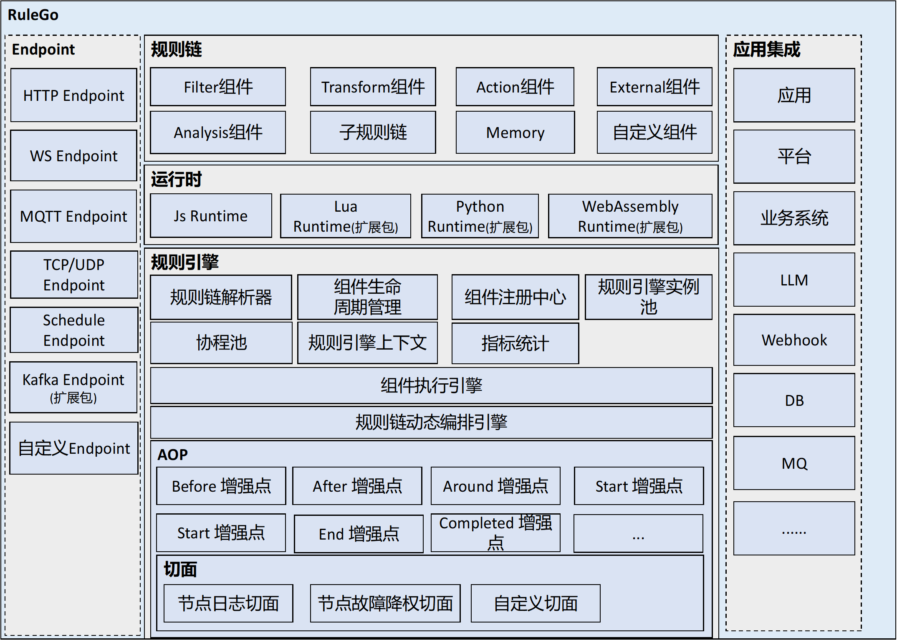

# RuleGo

[](https://pkg.go.dev/github.com/rulego/rulego)
[](https://goreportcard.com/report/github.com/rulego/rulego)
[](https://codecov.io/gh/rulego/rulego)
[](https://github.com/rulego/rulego/actions/workflows/test.yml)
[](https://github.com/rulego/rulego/actions/workflows/build.yml)

[English](README.md)| 中文

  

`RuleGo`是一个基于`Go`语言的轻量级、高性能、嵌入式、可编排组件式的规则引擎。支持异构系统数据集成，可以对输入消息进行聚合、分发、过滤、转换、丰富和执行各种动作。

<h3>您的鼓励是我们前进的动力。如果这个项目对您有帮助，请右上角点个Star吧。</h3>

## 文档

官网文档托管在： [rulego.cc](https://rulego.cc) 

## 特性

* **轻量级：** 无外部中间件依赖，在低成本设备中也能高效对数据进行处理和联动，适用于物联网边缘计算。
* **高性能：** 得益于`Go`的高性能特性，另外`RuleGo`采用协程池和对象池等技术。
* **嵌入式：** 支持把`RuleGo`嵌入到现有项目，非入侵式利用其特性。
* **组件化：** 所有业务逻辑都是组件，并能灵活配置和重用它们。
* **规则链：** 可以灵活地组合和重用不同的组件，实现高度定制化和可扩展性的业务流程。
* **流程编排：** 支持对规则链组件进行动态编排，不重启应用情况下，替换或者新增业务逻辑。
* **扩展简单：** 提供丰富灵活的扩展接口，可以很容易地实现自定义组件或者引入第三方组件。
* **动态加载：** 支持通过`Go plugin` 动态加载组件和扩展组件。
* **规则链嵌套：** 支持子规则链嵌套，实现流程复用。
* **内置大量组件：** `消息类型Switch`,`JavaScript Switch`,`JavaScript过滤器`,`JavaScript转换器`,`HTTP推送`，`MQTT推送`，`发送邮件`，`日志记录`
  等组件。可以自行扩展其他组件。
* **上下文隔离机制：** 可靠的上下文隔离机制，无需担心高并发情况下的数据串流。
* **AOP机制：** 允许在不修改规则链或节点的原有逻辑的情况下，对规则链的执行添加额外的行为，或者直接替换原规则链或者节点逻辑。
* **数据集成：** 允许动态配置Endpoint，例如：`HTTP Endpoint`，`MQTT Endpoint`，`TCP/UDP Endpoint`，`UDP Endpoint`，`Kafka Endpoint`，`Schedule Endpoint`等。

## 使用场景

`RuleGo`是一款编排式的规则引擎，最擅长去解耦你的系统。   

- 如果你的系统业务复杂，并且代码臃肿不堪       
- 如果你的业务场景高度定制化或者经常变动     
- 如果你的系统需要对接大量的第三方应用或者协议
- 或者需要端对端的物联网解决方案          
- 或者需要对异构系统数据集中处理      
- 或者你想尝试在`Go`语言实现热部署......             
那`RuleGo`框架会是一个非常好的解决方案。      

#### 典型使用场景

* **边缘计算：** 可以在边缘服务器部署`RuleGo`，对数据进行预处理，筛选、聚合或者计算后再上报到云端。数据的处理规则和分发规则可以通过规则链动态配置和修改，而不需要重启系统。
* **物联网：** 收集设备数据上报，经过规则链的规则判断，触发一个或者多个动作，例如：发邮件、发告警、和其他设备或者系统联动。
* **数据分发：** 可以根据不同的消息类型，调用HTTP、MQTT或者gRPC把数据分发到不同系统。
* **应用集成：** 把`RuleGo`当做胶水连接各种系统或者协议，例如：ssh、webhook、kafka、消息队列、数据库、chatGPT、第三方应用系统。
* **异构系统数据集中处理：** 从不同的数据源（如 MQTT、HTTP、WS、TCP/UDP 等）接收数据，然后对数据进行过滤、格式转换、然后分发到数据库、业务系统或者仪表板。
* **高度定制化业务：** 把高度定制化或者经常变化的业务解耦出来，交给`RuleGo`规则链进行管理。业务需求变化而不需要重启主程序。
* **复杂业务编排：** 把业务封装成自定义组件，通过`RuleGo`编排和驱动这些自定义的组件，业务逻辑并支持动态调整和替换。
* **微服务编排：** 通过`RuleGo`编排和驱动微服务，或者动态调用第三方服务处理业务，并返回结果。
* **业务代码和业务逻辑解耦：** 例如：用户积分计算系统、风控系统。
* **自动化：** 例如：CI/CD系统、流程自动化系统、营销自动化系统。
* **低代码：** 例如：低代码平台、iPaaS系统、ETL、类LangFlow系统（对接大模型提取用户意图，然后触发规则链与其他系统进行联动或者进行业务处理）。

## 架构图

  
<p align="center">RuleGo架构图</p>

## 规则链运行示例图

  

[更多运行模式](https://rulego.cc/pages/6f46fc/#%E8%A7%84%E5%88%99%E9%93%BE%E6%94%AF%E6%8C%81%E7%9A%84%E8%BF%90%E8%A1%8C%E6%96%B9%E5%BC%8F)

## 安装

使用`go get`命令安装`RuleGo`：

```bash
go get github.com/rulego/rulego
```

## 使用

RuleGo 使用极其简单和轻量级。只需以下3步：

1. 使用JSON定义规则链：
[规则链DSL](https://rulego.cc/pages/10e1c0/)

2. 导入`RuleGo`包，并使用规则链定义，创建一个规则引擎实例：

```go
import "github.com/rulego/rulego"

//使用规则链定义，创建一个规则引擎实例
ruleEngine, err := rulego.New("rule01", []byte(ruleFile))
```

3. 把消息负荷、消息类型、消息元数据交给规则引擎实例处理，然后规则引擎就会根据规则链的定义处理消息：

```go
//定义消息元数据
metaData := types.NewMetadata()
metaData.PutValue("productType", "test01")
//定义消息负荷和消息类型
msg := types.NewMsg(0, "TELEMETRY_MSG", types.JSON, metaData, "{\"temperature\":35}")

//把消息交给规则引擎处理
ruleEngine.OnMsg(msg)
```

### 规则引擎管理API

动态更新规则链

```go
//更新根规则链
err := ruleEngine.ReloadSelf([]byte(ruleFile))
//更新规则链下某个节点
ruleEngine.ReloadChild("rule_chain_test", nodeFile)
//获取规则链定义
ruleEngine.DSL()
```

规则引擎实例管理：

```go
//加载文件夹所有规则链定义到规则引擎池
rulego.Load("/rules", rulego.WithConfig(config))
//通过ID获取已经创建的规则引擎实例
ruleEngine, ok := rulego.Get("rule01")
//删除已经创建的规则引擎实例
rulego.Del("rule01")
```

配置：

详见[文档](https://rulego.cc/pages/d59341/)

```go
//创建一个默认的配置
config := rulego.NewConfig()
//调试节点回调，节点配置必须配置debugMode:true 才会触发调用
//节点入和出信息都会调用该回调函数
config.OnDebug = func (chainId,flowType string, nodeId string, msg types.RuleMsg, relationType string, err error) {
}
//使用配置
ruleEngine, err := rulego.New("rule01", []byte(ruleFile), rulego.WithConfig(config))
```
### 规则链定义DSL
[规则链定义DSL](https://rulego.cc/pages/10e1c0/)

### 节点组件
- [标准组件](https://rulego.cc/pages/88fc3c/) 
- [rulego-components](https://github.com/rulego/rulego-components)  [文档](https://rulego.cc/pages/d7fc43/) 
- [rulego-components-ai](https://github.com/rulego/rulego-components-ai) 
- [rulego-components-ci](https://github.com/rulego/rulego-components-ci) 
- [rulego-components-iot](https://github.com/rulego/rulego-components-iot) 
- [自定义节点组件示例](examples/custom_component) [文档](https://rulego.cc/pages/caed1b/)

## 数据集成
`RuleGo` 提供`Endpoint`模块对异构系统进行统一的数据集成和处理。详细参考： [Endpoint](endpoint/README_ZH.md)

### Endpoint组件
- [Endpoint组件](https://rulego.cc/pages/691dd3/)
- [Endpoint DSL](https://rulego.cc/pages/390ad7/)

## 性能

`RuleGo` 大部分工作都在启动时完成，执行规则链时几乎不会额外增加系统开销，资源占用极低，特别适合在边缘服务器运行。
另外RuleGo使用有向无环图来表示规则链，每个输入消息只需要沿着图中的路径进行处理，无需匹配所有的规则，
这大大提高了消息处理的效率和速度，也节省了资源和时间。路由算法能实现：不管规则链节点数量是多少，都不会影响节点路由性能。

性能测试用例：
```
机器：树莓派2(900MHz Cortex-A7*4,1GB LPDDR2)  
数据大小：260B   
规则链：JS脚本过滤->JS复杂转换->HTTP推送   
测试结果：100并发和500并发，内存占用变化不大都在19M左右
```

[更多性能测试用例](https://rulego.cc/pages/f60381/)

## 生态

- [RuleGo-Editor](https://editor.rulego.cc/) ：规则链可视化编辑器
- [RuleGo-CI](http://8.134.32.225:9090/ui/) ：CI/CD应用
- [rulego-components](https://gitee.com/rulego/rulego-components) ：扩展组件库
- [examples/server](examples/server) ：独立运行的示例工程
- [examples](examples) : 更多示例

## 贡献

欢迎任何形式的贡献，包括提交问题、建议、文档、测试或代码。请遵循以下步骤：

* 克隆项目仓库到本地
* 创建一个新的分支并进行修改
* 提交一个合并请求到主分支
* 等待审核和反馈

## 交流群

QQ群号：**720103251**     


[🎈加入社区讨论](https://rulego.cc/pages/257c28/)

## 许可

`RuleGo`使用Apache 2.0许可证，详情请参见[LICENSE](LICENSE)文件。