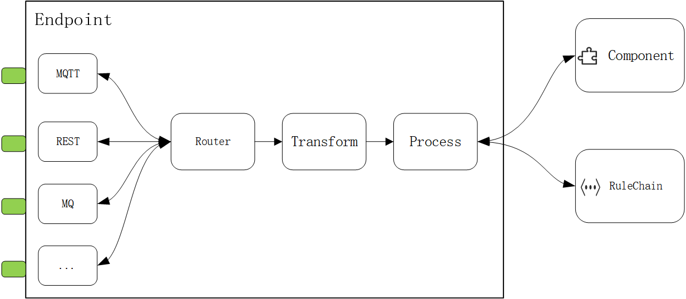

# Endpoint

English| [中文](README_ZH.md)

endpoint is a package that abstracts different input source data routing and heterogeneous system data integration, it allows you to easily create and start different receiving services, such as HTTP or MQTT, then according to different requests or messages, perform transformation, processing, routing and other operations, and finally hand over to the rule chain or component for processing.



## Usage

### Create Router

Router is a type that defines routing rules, it can specify input end, transformation function, processing function, output end and so on. You can use NewRouter function to create a Router type pointer, then use From method to specify input end, return a From type pointer.

```go
router := endpoint.NewRouter().From("/api/v1/msg/")
```

### Add processing functions

From type has two methods to add processing functions: Transform and Process. Transform method is used to transform input message into RuleMsg type, Process method is used to process input or output message. These two methods both accept a Process type function as parameter, return a From type pointer. Process type function accepts an Exchange type pointer as parameter, returns a boolean value indicating whether to continue executing the next processing function. Exchange type is a struct that contains an input message and an output message, used to pass data in processing functions.

```go
router := endpoint.NewRouter().From("/api/v1/msg/").Transform(func(exchange *endpoint.Exchange) bool {
    //transformation logic
    return true
}).Process(func(exchange *endpoint.Exchange) bool {
    //processing logic
    return true
})
```

### Response

You can use the Exchange's Out message to respond to the client in the conversion or processing function
```go
//Response StatusCode
exchange.Out.SetStatusCode(http.StatusMethodNotAllowed)
//Response header
exchange.Out.Headers().Set("Content-Type", "application/json")
//Response content
exchange.Out.SetBody([]byte("ok"))
```
Note: mqtt endpoint calling SetBody() will use the specified topic to public data to the broker, specify the topic using the following method

```go
exchange.Out.Headers().Set("topic", "your topic")
```

### Set output end

From type has two methods to set output end: To and ToComponent. To method is used to specify routing target path or component, ToComponent method is used to specify output component. These two methods both return a To type pointer.

To method's parameter is a string, representing component path, format is {executorType}:{path}. executorType is executor component type, path is component path. For example: "chain:{chainId}" means executing rule chain registered in rulego, "component:{nodeType}" means executing component registered in config.ComponentsRegistry. You can register custom executor component types in DefaultExecutorFactory. To method can also accept some component configuration parameters as optional parameters.

```go
router := endpoint.NewRouter().From("/api/v1/msg/").Transform(func(exchange *endpoint.Exchange) bool {
    //transformation logic
    return true
}).To("chain:default")
```

ToComponent method's parameter is a types.Node type component, you can customize or use existing components.

```go
router := endpoint.NewRouter().From("/api/v1/msg/").Transform(func(exchange *endpoint.Exchange) bool {
    //transformation logic
    return true
}).ToComponent(func() types.Node {
        //define log component, process data
        var configuration = make(types.Configuration)
        configuration["jsScript"] = `
        return 'log::Incoming message:\n' + JSON.stringify(msg) + '\nIncoming metadata:\n' + JSON.stringify(metadata);
        `
        logNode := &action.LogNode{}
        _ = logNode.Init(config, configuration)
        return logNode
}())
```
Use To method call component
```go
router := endpoint.NewRouter().From("/api/v1/msg/").Transform(func(exchange *endpoint.Exchange) bool {
    //转换逻辑
    return true
}).To"component:log", types.Configuration{"jsScript": `
		return 'log::Incoming message:\n' + JSON.stringify(msg) + '\nIncoming metadata:\n' + JSON.stringify(metadata);
`})
```

### End routing

To type has a method to end routing: End. End method returns a Router type pointer.

```go
router := endpoint.NewRouter().From("/api/v1/msg/").Transform(func(exchange *endpoint.Exchange) bool {
    //transformation logic
    return true
}).To("chain:default").End()
```

### Create RestEndPoint

RestEndPoint is a type that creates and starts HTTP receiving service, it can register different routes to handle different requests. You can create a Rest type pointer and specify service address and other configurations.

```go
restEndpoint := &rest.Rest{Config: rest.Config{Addr: ":9090"}}
```

You can use restEndpoint.AddInterceptors method to add global interceptors for permission verification and other logic.

```go
restEndpoint.AddInterceptors(func(exchange *endpoint.Exchange) bool {
		//permission verification logic
		return true
})
```

You can use restEndpoint.GET or restEndpoint.POST methods to register routes, corresponding to GET or POST request methods. These methods accept one or more Router type pointers as parameters.

```go
restEndpoint.GET(router1, router2)
restEndpoint.POST(router3, router4)
```

You can use restEndpoint.Start method to start service.

```go
_ = restEndpoint.Start()
```

### Create MqttEndpoint

MqttEndpoint is a type that creates and starts MQTT receiving service, it can subscribe different topics to handle different messages. You can create a Mqtt type pointer and specify service address and other configurations.

```go
mqttEndpoint := &mqtt.Mqtt{
        Config: mqtt.Config{
            Server: "127.0.0.1:1883",
        },
}
```

You can use mqttEndpoint.AddInterceptors method to add global interceptors for permission verification and other logic.

```go
mqttEndpoint.AddInterceptors(func(exchange *endpoint.Exchange) bool {
        //permission verification logic
	return true
})
```
You can use the mqttEndpoint.AddRouter method to register routes, this method accepts a Router type pointer as a parameter.

```go
_ = mqttEndpoint.AddRouter(router1)
```

You can use the mqttEndpoint.Start method to start the service.

```go
_ = mqttEndpoint.Start()
```

## Examples

Here are some examples of using the endpoint package:     
[RestEndpoint](rest/rest_test.go)       
[MqttEndpoint](mqtt/mqtt_test.go)

## Extending endpoint

The endpoint package provides some built-in types of receiving services, such as Rest and Mqtt, but you can also customize or extend other types of receiving services, such as Kafka. To achieve this, you need to follow these steps:

1. Implement the Message interface. The Message interface is an interface that abstracts different input source data, it defines some methods to get or set the message content, header, source, parameter, status code, etc. You need to implement this interface for your receiving service type, so that your message type can interact with other types in the endpoint package.
2. Implement the EndPoint interface. The EndPoint interface is an interface that defines different receiving service types, it defines some methods to start, stop, add routes and interceptors, etc. You need to implement this interface for your receiving service type, so that your service type can interact with other types in the endpoint package.
3. Register the Executor type. The Executor interface is an interface that defines different output end executors, it defines some methods to initialize, execute, get path, etc. You can implement this interface for your output end component, and register your Executor type in the DefaultExecutorFactory, so that your component can be called by other types in the endpoint package.

These are the basic steps to extend the endpoint package, you can refer to the existing implementations of [Rest](rest/rest.go) and [Mqtt](mqtt/mqtt.go) types in the endpoint package to write your own code.